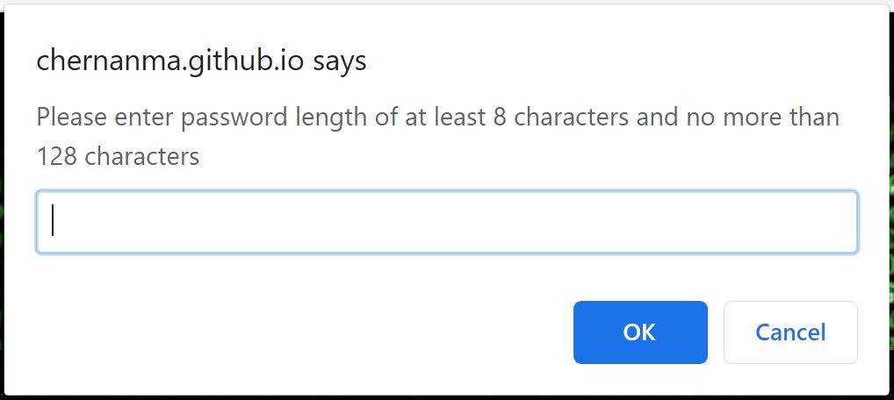

# Homework03 - Password Generator

In this project, we are randomly generating a password base on criteria entered by the user.
  
[Click here to Access Password Generator](https://chernanma.github.io/Homework03/Develop/)

---

## Criteria used to Generate Security Password 

* Number entered for the Lenght of the password must be between 8 and 128.
* Character type to include in the password could be the following:
    * L/l to include Lowercase characters
    * U/u to include Uppercase characters
    * N/n to include Number characters
    * S/s to include Special characters
---
## How to use Password Generator

1. Click on "Generate Password"
2. Enter Length for the password, choose a length of at least 8 characters and no more than 128
3. Click OK
3. Enter character type, L/l for Lowercase, U/u for Uppercase, N/n for Numbers or S/s for the special characters

    3.1 Example: if you want a password that contains Numbers, Lowercase, and Special characters. Input would be:

        * n,l,s OR N,L,S OR nls or NLS
4. Click OK

After clicking OK in the last prompt the new password will be generated and showed in the center of the webpage.

---
## Some Screenshots

### Main page
---

### Prompt for Password Length
---

### Prompt for Character Type
---

### Main page showing Password Generated
---
